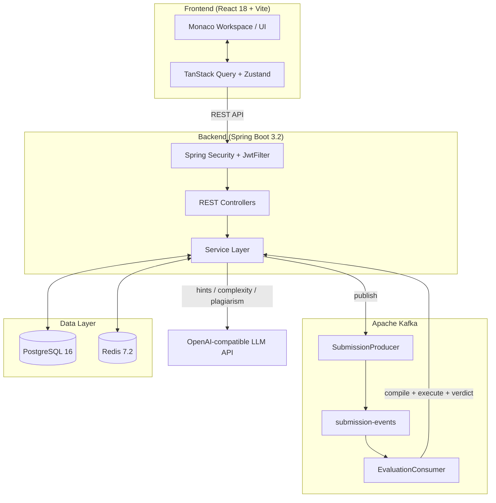
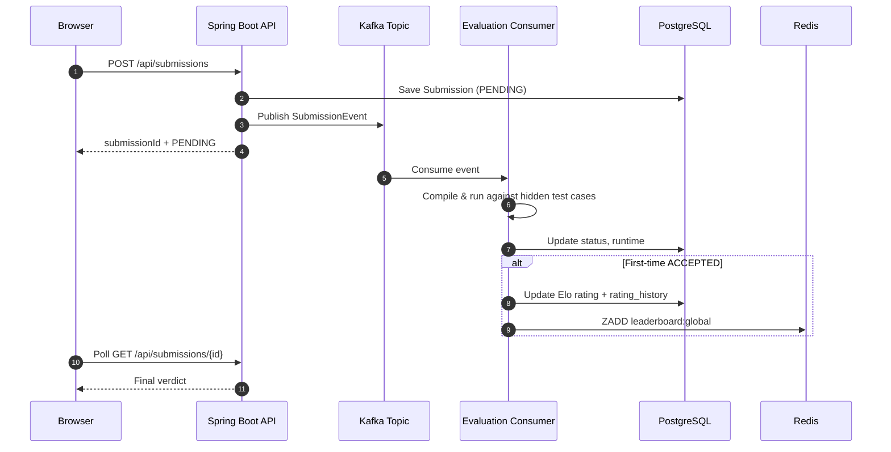
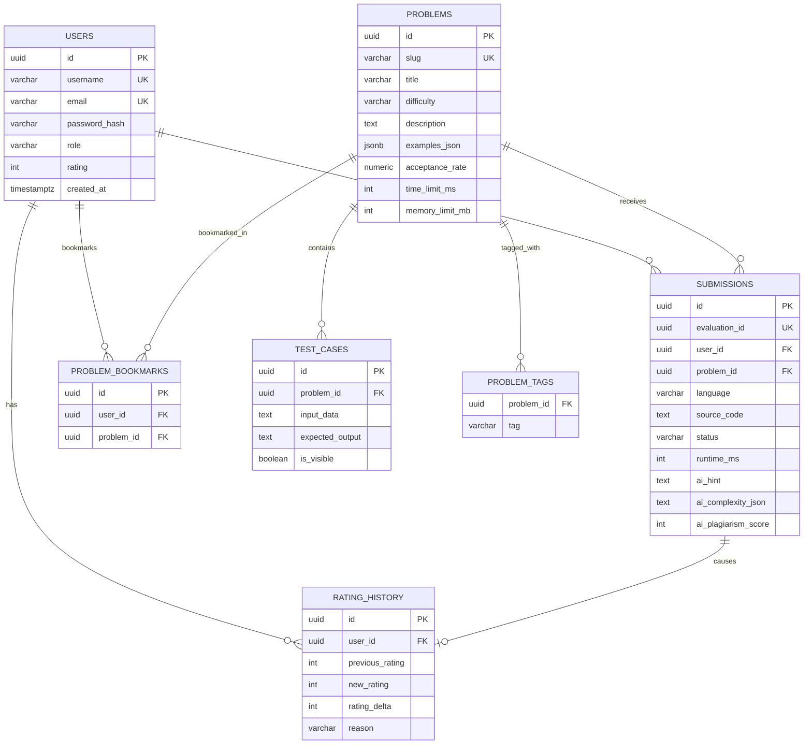

# CodeAscend

> **A full-stack competitive programming platform — solve algorithmic problems, get AI-assisted hints, climb an Elo-based leaderboard, and track your progress with detailed analytics.**

[](LICENSE)
[](https://jdk.java.net/21/)
[](https://spring.io/projects/spring-boot)
[](https://react.dev/)
[](https://www.typescriptlang.org/)
[](https://www.postgresql.org/)
[](https://redis.io/)
[](https://www.docker.com/)

---

## Table of Contents

- [Overview](#overview)
- [Screenshots](#screenshots)
- [Features](#features)
- [System Architecture](#system-architecture)
- [Tech Stack](#tech-stack)
- [Project Structure](#project-structure)
- [Getting Started](#getting-started)
- [Environment Variables](#environment-variables)
- [API Reference](#api-reference)
- [Database Schema](#database-schema)
- [How the Judge Works](#how-the-judge-works)
- [Design Notes & Known Limitations](#design-notes--known-limitations)
- [Roadmap](#roadmap)
- [Contributing](#contributing)
- [License](#license)

---

## Overview

**CodeAscend** is an open-source competitive programming platform, similar in spirit to LeetCode or Codeforces. Users solve algorithmic problems in Java, Python, C++, or JavaScript, get instant feedback from an in-browser judge, receive optional AI-generated hints, and compete on a global Elo-based leaderboard.

The project is built as a **modular monolith**: a single Spring Boot backend organized into clean, feature-based packages (`auth`, `problem`, `submission`, `rating`, `leaderboard`, `analytics`, `ai`), paired with a feature-sliced React + TypeScript frontend. It's designed to demonstrate real backend engineering patterns — event-driven processing, cache-backed leaderboards, resilient degradation when infrastructure is unavailable — without the operational overhead of actual microservices.

**Highlights:**
- Async, Kafka-driven code evaluation pipeline (submit → queue → judge → verdict)
- Custom judge engine supporting Java, Python, C++, and JavaScript
- Elo rating system with anti-farming protection
- Redis-backed leaderboard with automatic PostgreSQL fallback
- Optional AI Coach (hints, complexity analysis, plagiarism scoring, code review) — fully functional even without an API key, via graceful fallbacks
- 365-day activity heatmap, topic-mastery breakdown, and rating history charts
- Every external dependency (Kafka, Redis, OpenAI) is optional at runtime — the app degrades gracefully instead of crashing

---

## Screenshots


---

## Features

### Authentication
- Stateless JWT authentication (HS256) with BCrypt password hashing
- Role-based access (`USER` / `ADMIN`) via Spring Security
- Public problem browsing without login; protected write/user-scoped endpoints

### Coding Workspace
- Monaco Editor (the engine behind VS Code) embedded in-browser
- Multi-language support: Java, Python, C++, JavaScript
- **Run mode** — quick, synchronous execution against custom stdin for debugging
- **Submit mode** — official, asynchronous evaluation against hidden test cases, feeding into your rating
- Execution telemetry: runtime (ms) per submission

### Judge Engine
- Kafka-based async pipeline (`submission-events` topic) so the API never blocks on code execution
- Per-language compile/run strategy (`javac`/`java`, `g++`/binary, `python3`, `node`)
- Timeout enforcement with forced process termination
- Verdicts: `ACCEPTED`, `WRONG_ANSWER`, `TIME_LIMIT_EXCEEDED`, `RUNTIME_ERROR`, `COMPILATION_ERROR`
- Self-healing background job recovers submissions stuck in `PENDING`/`RUNNING` (e.g. after a worker crash)

### Competitive Programming
- Elo-style rating algorithm (K-factor 32), scaled to each problem's difficulty tier
- Anti-farming: re-solving an already-accepted problem awards zero rating
- Deterministic daily challenge (rotates automatically, no manual scheduling needed)
- Bookmarks, submission history, and per-problem submission log
- Global leaderboard backed by a Redis Sorted Set, with rank tiers (Newbie → Grandmaster)

### Analytics & Profile
- Rating history chart (every rating change is logged with a reason)
- 365-day submission heatmap
- Difficulty breakdown and topic-mastery radar ("Code DNA")
- Achievement badges computed from live stats (streaks, solve counts, ratings)
- Personalized "next problem" recommendation based on your weakest topic

### AI Coach (optional, OpenAI-compatible)
- Non-spoiler hints based on your current code and the problem statement
- Time/space complexity analysis (LLM-generated, returned as structured JSON)
- Two-tier plagiarism detection: free local Jaccard-similarity heuristic + optional deeper LLM semantic check
- Short code-quality feedback
- **Works without an API key** — every AI feature has a sensible hardcoded fallback, so the platform is fully usable out of the box

---

## System Architecture



### Submission Lifecycle



If Kafka or Redis is unreachable, the corresponding service falls back automatically (see [Design Notes](#design-notes--known-limitations)) rather than failing the request.

---

## Tech Stack

| Layer | Technology |
|---|---|
| **Frontend** | React 18, TypeScript, Vite, Tailwind CSS, Framer Motion |
| **Editor** | Monaco Editor |
| **Charts** | Recharts |
| **State** | TanStack Query (server state) + Zustand (client state) |
| **Backend** | Java 21, Spring Boot 3.2, Spring Security, Spring Data JPA |
| **Auth** | JJWT (JWT, HS256), BCrypt |
| **Database** | PostgreSQL 16, Flyway migrations |
| **Cache / Leaderboard** | Redis 7.2 (Sorted Sets) |
| **Messaging** | Apache Kafka 3.7 (KRaft mode, no Zookeeper) |
| **AI** | Any OpenAI-compatible Chat Completions API |
| **Infra (dev)** | Docker Compose |

---

## Project Structure

```
CodeAscend/
├── backend/
│   └── src/main/
│       ├── java/com/codearenaai/
│       │   ├── auth/            # Register/login, JWT issuing
│       │   ├── user/            # User entity, public profile aggregation
│       │   ├── problem/         # Problem catalog, test cases, tags, bookmarks
│       │   ├── submission/      # Run/submit, Kafka pipeline, judge engine
│       │   ├── rating/          # Elo rating calculation + history
│       │   ├── leaderboard/     # Redis-backed ranking
│       │   ├── analytics/       # User & platform analytics
│       │   ├── dashboard/       # Home dashboard summary
│       │   ├── ai/              # OpenAI-integrated AI coach
│       │   ├── security/        # JwtFilter, SecurityConfig
│       │   └── config/          # Redis, Jwt, MapStruct configuration
│       └── resources/
│           ├── db/migration/    # Flyway SQL migrations (V1–V7)
│           └── application.yml
├── frontend/
│   └── src/
│       ├── features/            # auth, problems, submissions, dashboard,
│       │                        # leaderboard, analytics, profile, landing
│       ├── components/          # Shared UI + layout components
│       ├── lib/api/             # Axios clients per domain
│       ├── stores/              # Zustand stores
│       ├── providers/           # TanStack Query provider
│       └── router/               # React Router routes
├── docker-compose.yml            # PostgreSQL, Redis, Kafka (infra only)
└── README.md
```

---

## Getting Started

### Prerequisites
- **JDK 21**
- **Node.js 18+** and npm
- **Docker** (for PostgreSQL, Redis, Kafka)

### 1. Clone the repository

```bash
git clone https://github.com/<your-username>/CodeAscend.git
cd CodeAscend
```

### 2. Start infrastructure

```bash
docker-compose up -d
docker-compose ps   # confirm all services report healthy
```

This brings up PostgreSQL (`5432`), Redis (`6379`), and Kafka (`9092`). Flyway will run migrations automatically on backend startup.

### 3. Run the backend

```bash
cd backend
./mvnw spring-boot:run       # macOS/Linux
mvnw.cmd spring-boot:run     # Windows
```

API will be available at `http://localhost:8080/api`.

### 4. Run the frontend

```bash
cd frontend
npm install
npm run dev
```

App will be available at `http://localhost:5173`.

> **Note:** Kafka, Redis, and the AI service are all optional at runtime — the app will boot and serve requests even if one of them is unavailable, with reduced functionality (see [Design Notes](#design-notes--known-limitations)).

---

## Environment Variables

### Backend (`backend/src/main/resources/application.yml` or environment)

| Variable | Required | Default | Description |
|---|---|---|---|
| `SPRING_DATASOURCE_URL` | Yes | `jdbc:postgresql://localhost:5432/codearena_ai` | PostgreSQL connection string |
| `SPRING_DATASOURCE_USERNAME` | Yes | `codearena` | Database username |
| `SPRING_DATASOURCE_PASSWORD` | Yes | `codearena` | Database password |
| `SPRING_DATA_REDIS_HOST` | No | `localhost` | Redis host (optional — app degrades gracefully) |
| `SPRING_DATA_REDIS_PORT` | No | `6379` | Redis port |
| `SPRING_KAFKA_BOOTSTRAP_SERVERS` | No | `localhost:9092` | Kafka bootstrap servers (optional — see fallback behavior) |
| `JWT_SECRET` | Yes | — | Secret key used to sign JWTs (32+ chars recommended) |
| `JWT_ISSUER` | No | `codearena-ai` | JWT `iss` claim |
| `OPENAI_API_KEY` | No | *(empty)* | Enables live AI features; omit to use fallback responses |
| `APPLICATION_AI_OPENAI_MODEL` | No | `gpt-4o-mini` | Model used for AI Coach calls |

### Frontend (`frontend/.env`)

| Variable | Required | Default | Description |
|---|---|---|---|
| `VITE_API_BASE_URL` | Yes | `http://localhost:8080/api` | Backend API base URL |

---

## API Reference

All routes are prefixed with `/api` (Spring's `server.servlet.context-path`).

### Auth (`/auth`)
| Method | Path | Description |
|---|---|---|
| POST | `/auth/register` | Create a new account |
| POST | `/auth/login` | Authenticate and receive a JWT |
| GET | `/auth/me` | Get the current authenticated user |

### Problems (`/problems`)
| Method | Path | Description |
|---|---|---|
| GET | `/problems` | Paginated list with search, difficulty, and tag filters |
| GET | `/problems/{slug}` | Problem detail (description, visible test cases) |
| GET | `/problems/daily-challenge` | Today's featured problem |
| GET | `/problems/tags` | All available problem tags |
| GET | `/problems/bookmarked` | Current user's bookmarked problems |
| POST | `/problems/{slug}/bookmark` | Toggle bookmark on a problem |
| GET | `/problems/{slug}/estimated-elo` | Preview rating gain before submitting |

### Submissions (`/submissions`)
| Method | Path | Description |
|---|---|---|
| POST | `/submissions` | Submit code for official (async) evaluation |
| POST | `/submissions/run` | Run code synchronously against custom input |
| GET | `/submissions/my` | Current user's submission history |
| GET | `/submissions/{id}` | Submission detail / poll for verdict |
| GET | `/submissions/problem/{slug}` | Submissions for a given problem |
| POST | `/submissions/{id}/hint` | Request an AI hint for a submission |

### Leaderboard (`/leaderboard`)
| Method | Path | Description |
|---|---|---|
| GET | `/leaderboard` | Paginated global leaderboard |
| GET | `/leaderboard/me` | Current user's rank |

### Analytics & Dashboard
| Method | Path | Description |
|---|---|---|
| GET | `/dashboard` | Home dashboard summary |
| GET | `/analytics/dashboard` | Platform-wide analytics |
| GET | `/analytics/user/{userId}` | Per-user analytics (heatmap, topic mastery, rating history) |

### Users (`/users`)
| Method | Path | Description |
|---|---|---|
| GET | `/users/profile/me` | Current user's full profile |
| GET | `/users/profile/{username}` | Public profile by username |

---

## Database Schema

Schema is managed with **Flyway** (`V1__init.sql` through `V7__add_rating_history.sql`), applied automatically on backend startup.



Notable design choices:
- **UUID primary keys** everywhere (non-enumerable, distributed-system-friendly)
- **`CHECK` constraints** at the database level in addition to application validation (e.g. `rating >= 0`, valid `role` values)
- **`examples_json` as JSONB** rather than a normalized table — the data is small, bounded, and always fetched as a unit
- **`rating_history`** stores `previous_rating`/`new_rating` explicitly (not just the delta) as an immutable audit trail

---

## How the Judge Works

1. **Submit** → a `Submission` row is created with status `PENDING`, and an event is published to the Kafka topic `submission-events`. The API responds immediately — it never blocks on code execution.
2. **Consume** → `EvaluationConsumer` (consumer group `codearena-evaluator`) picks up the event and hands it to the evaluator.
3. **Compile & run** → depending on language, source code is compiled (Java/C++) and executed in a temporary directory via `ProcessBuilder`, piping in each test case's input and comparing normalized stdout against the expected output. Execution stops at the first failing test case.
4. **Timeout handling** → each run is bounded by the problem's time limit; timed-out processes are forcibly terminated and marked `TIME_LIMIT_EXCEEDED`.
5. **Verdict & rating** → on the first-ever `ACCEPTED` verdict for a problem, `RatingService` applies an Elo-style update and logs it to `rating_history`; the leaderboard's Redis Sorted Set is updated in the same step.
6. **AI pass (best-effort)** → hint generation, complexity analysis, and plagiarism scoring run afterward and are never allowed to affect the core verdict — if the AI call fails or no API key is configured, static fallback content is used instead.
7. **Self-healing** → a scheduled job checks every minute for submissions stuck in `PENDING`/`RUNNING` for more than 5 minutes (e.g. after a worker crash) and marks them `RUNTIME_ERROR` so they never hang indefinitely.

---

## Design Notes & Known Limitations

This project favors resilience and clarity over exhaustive production-hardening. A few things worth knowing if you plan to deploy it or extend it:

- **No container-level sandboxing.** Code executes via `ProcessBuilder` on the host, not inside Docker/gVisor/Firecracker. This is fine for local/demo use but is **not safe for an untrusted, internet-facing deployment** — running arbitrary user code without isolation is a real code-execution risk. Adding a proper sandbox (isolated containers, no network, resource limits, non-root user) is the top priority before exposing this publicly.
- **Memory limits are not enforced**, only requested — `memory_limit_mb` is accepted but the reported memory usage is a placeholder rather than a real measurement.
- **Graceful degradation is a deliberate, consistent pattern**: if Kafka is unreachable, submissions are marked `RUNNING` and later recovered by the stale-submission job; if Redis is unreachable, leaderboard rank falls back to a PostgreSQL count query; if no OpenAI key is set, every AI feature returns a sensible static fallback. The app is designed to never hard-fail because of an optional dependency.
- **No refresh tokens** — JWTs are short-lived with no rotation/blacklist mechanism; expired tokens require a fresh login.
- **Leaderboard reads are hybrid**: individual rank lookups use Redis (`ZREVRANK`, O(log N)), but the full paginated listing is served from PostgreSQL (since it needs joined data like solve counts) — Redis's range-query strength (`ZRANGE`) isn't used for the listing itself.
- **Streak and heatmap calculations are computed on demand** from full submission history rather than incrementally maintained, which won't scale indefinitely for very active users.

Contributions that address any of the above are very welcome — see [Contributing](#contributing).

---

## Roadmap

- [ ] Container-based sandboxing for code execution (security hardening)
- [ ] Scheduled/live contests with real-time scoreboards
- [ ] WebSocket-based live judging (replace client polling)
- [ ] Discussion forums and community editorials
- [ ] Team contests and a social/friends system
- [ ] Refresh-token based auth with revocation support

---

## Contributing

Contributions, issues, and feature requests are welcome.

1. Fork the repository
2. Create a feature branch (`git checkout -b feature/my-feature`)
3. Commit your changes with clear messages
4. Push and open a Pull Request

Please keep PRs focused and include a short description of what changed and why.

---

## License

Distributed under the MIT License. See [`LICENSE`](LICENSE) for details.
